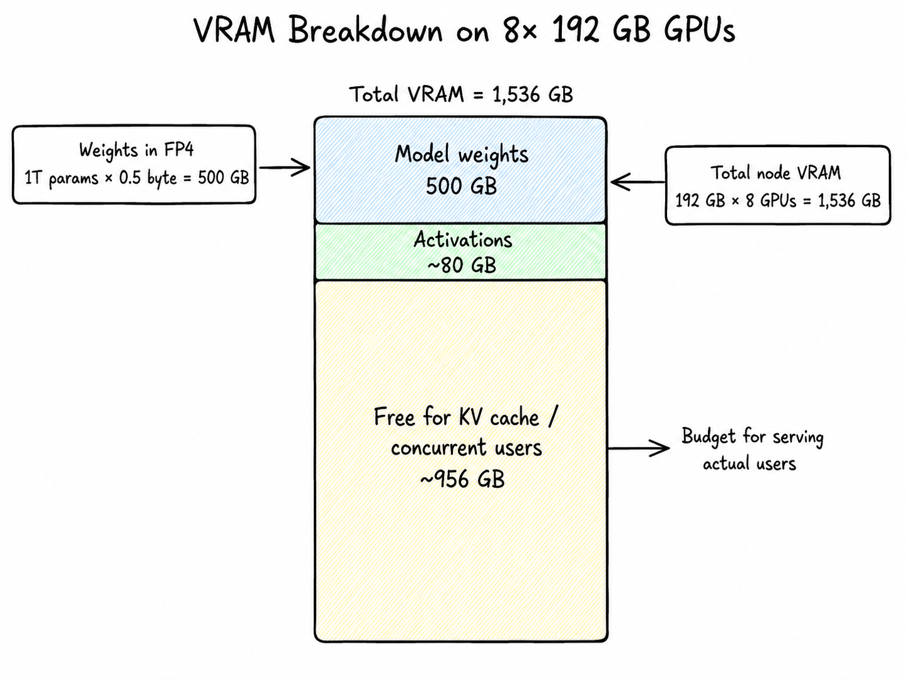
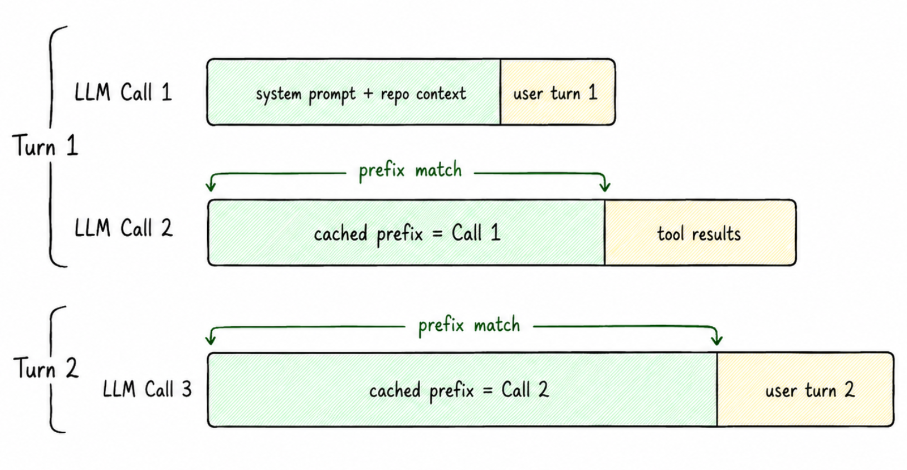
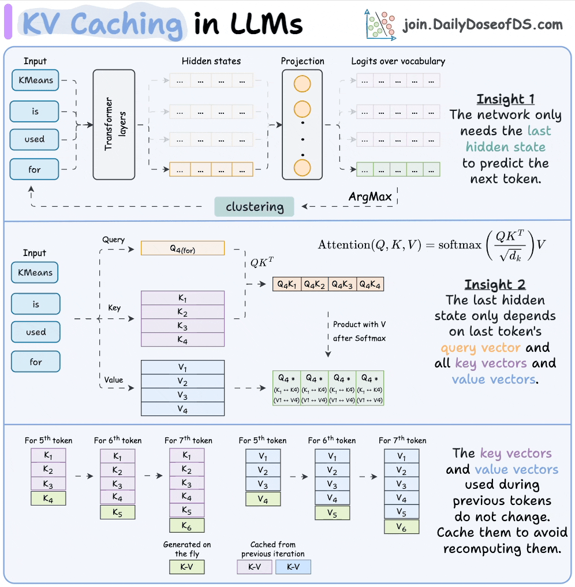

# How many GPUs do we need to serve the model?

Loading the model is one thing. Serving real traffic is another, and it costs more VRAM. Every concurrent user needs their own slice of [KV cache](https://www.ultralytics.com/glossary/kv-cache) (per-user memory that keeps attention from being quadratic so that new inference requests use caching). You also need bandwidth and headroom to batch their requests efficiently. We'll cover KV Cache, bandwidth and headroom in the next sections, for now, just trust that this is where the rest of the VRAM goes.

So we're taking the full 8-GPU B200 node: 1,536 GB of total VRAM. Here's how that breaks down:

| What | Math | Memory used | Remaining |
|---|---|---|---|
| Total VRAM on the node | 192 GB × 8 GPUs | — | **1,536 GB** |
| Model weights | 1T params × 0.5 byte | 500 GB | 1,036 GB |
| Activations (working memory during a forward pass) |  | ~80 GB | 956 GB |
| **Free for KV cache (i.e. concurrent users)** |  |  | **~956 GB** |

That ~956 GB is the budget for actually serving users. The next several sections are how we spend it.



## Serving the model

Two things happen on every request: the model reads the whole prompt (prefill), then writes tokens one by one (decode). We'll cover decode first because it's the dominant cost on long generations, then circle back to prefill.

Here's the TLDR of Decode. LLMs generate one token at a time. The model writes a token, looks at everything so far (your prompt + the tokens it just wrote), and writes the next one. It loops until  its done.

```abap
[prompt] → token_1
[prompt + token_1] → token_2
[prompt + token_1 + token_2] → token_3
...
```

Each loop iteration is one [**forward pass**](https://medium.com/@njorogeofrey73/forward-pass-3f716ed71f19): the input runs through dozens of layers, each layer reads its slice of weights from VRAM and hands its output to the next, and at the end you get a probability distribution over the next token. The model samples one and repeats.

So inference is just: read weights from VRAM → matrix math → emit a token → repeat.

## Emitting a token (Decode)

For the 32B active params, if we have to generate an output token we need the following data flow(FP4 [quantization](https://en.wikipedia.org/wiki/Block_floating_point) is 0.5 bytes per param):

```javascript
bytes_read_per_token = 32B active × 0.5 byte = 16 GB
```

16 GB of weight data flowing across the bandwidth pipe for every single token we generate. This is the main bottleneck number.

The B200 does 8 TB/s of memory bandwidth per GPU. Sounds enormous, but watch what happens when we run the math. Max output speed is just `bandwidth ÷ bytes_per_token`.

```javascript
Single B200:       8 TB/s
8-GPU node (raw):  64 TB/s
8-GPU node (real): ~50 TB/s after sync overhead
```

```javascript
50,000 GB/s ÷ 16 GB/token ≈ 3,125 tok/s theoretical
At 10–12% real-world MBU* ≈ 312–375 tok/s aggregate decode
```

So at *small batch sizes*, a full 8-GPU B200 node serving Kimi K2.6 in FP4 hits a theoretical ceiling of roughly 3,125 tokens per second of aggregate decode. 

Decode is sequential so you can't generate token N+1 until token N is done. That's why decode is bandwidth-bound, and why **TPS (tokens per second)** is the metric that decides how fast the output streams. (Exception: [speculative decoding](https://pytorch.org/blog/hitchhikers-guide-speculative-decoding/).)

## Caveats of theoretical max decode throughput vs actual max throughput

The 16 GB/token figure above assumes that every token reads its own personal slice of experts, which is true at batch=1, but it stops being true the moment you batch. Once many users flow through the same forward pass, tokens *share* expert reads [inside MoE](https://en.wikipedia.org/wiki/Mixture_of_experts), the effective bytes-per-token shrinks, and aggregate decode climbs well past this number. There are also other aspects to consider. We'll work out exactly how this works in the Batching section.

That 3,125 tok/s number is theoretical: what you actually get is determined by your MBU (Memory Bandwidth Utilization), the fraction of nominal bandwidth your inference stack actually delivers to useful work. MBU varies widely: We measured ~11% MBU on vLLM + Kimi K2.6 + 8× B200 + 80K context, on the lower end.

Our practical takeaway is that you shouldn’t trust theoretical ceilings, and don't trust vendor claims either. You can do load tests and compute your achieved MBU as 

`(measured aggregate decode tok/s × bytes_per_token) ÷ nominal_node_bandwidth`

Then cross-reference it with research papers to see if you are too far off, and if you are too far off then you must find out why.

Before going further, there's two ideas you need to lock in that will explain the real bottlenecks of GPU performance for inference and they are: 

1. Memory-bound vs compute-bound

2. Arithmetic intensity

## Memory Vs Compute bounds

This shows up constantly in transformer inference, and [in deep learning optimization more broadly](https://horace.io/brrr_intro.html). The basic idea is that: to do any math on a GPU, you first have to pull the weights out of memory, which costs [memory bandwidth](https://en.wikipedia.org/wiki/Memory_bandwidth). The good news (and this has been very well optimized) is that the GPU can start computing as soon as the first weights arrive memory reads and math run in parallel.

So at any given moment, one of two things is happening:

- **Compute-bound/Flop-bound**: In this case, the GPU is choking on math. The math units are fully busy, and memory is sitting idle. A FLOP is one floating-point operation. One multiply, one add, one of those. When people say a GPU does "15 PFLOPS," they mean it can do 15 × 10¹⁵ floating-point operations per second. You can read more about compute/flop bounds in [these lecture notes](https://www.stat.cmu.edu/~ryantibs/convexopt-F18/scribes/Lecture_19.pdf).  

- **Memory-bound**: the memory pipe is fully busy, and the math units are sitting idle.

Let me remind you once again that decode is memory-bandwidth-bound, and that is a huge bottleneck on how fast we can do our inference.

## Arithmetic intensity

Since at any point the GPU is either memory or compute bound. Arithmetic intensity is the knob that flips a workload between the two: FLOPs done per byte read from memory.

```javascript
arithmetic_intensity = FLOPs performed / bytes read from HBM
```

Every GPU has a break-even point (the "ridge" of the [roofline model](https://en.wikipedia.org/wiki/Roofline_model)) where compute and bandwidth finish at the same time. Below the ridge you're memory-bound; above it you're compute-bound. 

For the B200 at FP4:

```javascript
ridge = peak_flops / peak_bandwidth
      = 10 PFLOPS / 8 TB/s
      ≈ 1,250 FLOPs per byte
```

So on a B200, a kernel needs to do **~1,250 ops per byte of weight** before compute becomes the bottleneck. Anything less and the math units are sitting idle waiting on HBM.

Now look at where decode and prefill land:

- **Decode (batch=1)**: ~2 FLOPs per byte read (one multiply-add per weight value). Deep in memory-bound territory. ~600× below the ridge. This is *why* decode tok/s is dictated by bandwidth, not flops(as i had mentioned before).

- **Prefill**: You read the same weight once and reuse it across thousands of tokens (or batching). Arithmetic intensity scales roughly linearly with how many tokens share that read. Push enough tokens through one forward pass and you cross the ridge into compute-bound land.

This is the lens to keep in your head for the rest of the blog. Every optimization that follows is, underneath, a trick to raise arithmetic intensity so each byte of HBM traffic produces more useful tokens. As we do load testing later and put more weight on our GPUs, we'll see both of these bounds in practice.

## Loading the prompt tokens (Prefill)

The next concept you need to learn is prefill. Prefill is when the whole prompt the user throws at you gets read in a large parallel [mat mul operation](https://en.wikipedia.org/wiki/Matrix_multiplication) so that the model can "process it" and give you a response (decode). 

](images/illustrated-transformer.png)

## Why can you do prefill in parallel?

Because you already know the entire sequence, you can push it through the layers in parallel. In one weight read, thousands of tokens get processed simultaneously. The bandwidth bottleneck disappears because you're amortizing one read across thousands of tokens. 

Prefill is compute-bound. In our case, the B200 GPU has way more compute than bandwidth: ~10 PFLOPS dense at FP4 per GPU, and we have 8 GPUs.

Realistic prefill speeds reach ~78,000 input tokens/sec aggregate on an 8-GPU B200 node, roughly 1 coding-agent-sized fresh prompt processed per second on a long Kimi K2.6 conversation. That's what we'd expect to measure at Cline running this workload.

## Math to explain it

```javascript
Flops per GPU    = 10 PFLOPS
flops_per_token  = 2 × 32B active = 64 GFLOPs
node_compute     = 8 GPUs × 10 PFLOPS = 80 PFLOPS (dense FP4)
theoretical_max  = 80 PFLOPS ÷ 64 GFLOPs ≈ 1.25M tok/s
realistic        ≈ 6.4% MFU (attention quadratic + MoE all-to-all,
                          partially offset by B200 attention pipeline)
                 ≈ 78,000 tok/s on long prompts (this was what we got in load testing)
```

```abap
MFU(Model FLOPS Utilization) = (achieved FLOPs/sec on model work) / (peak FLOPs/sec of the hardware)
```

MFU is the reality check on your prefill numbers. Compare your measured MFU against the ranges published in literature if you're too far off, either your stack has a real problem or another provider is squeezing far more out of the same hardware.  

## TTFT: Time To First Token

This is where the metric **TTFT** (Time To First Token) comes from, the wait between hitting enter on chat and seeing the first character stream back. Everything before the first token appearing on chat is prefill burning compute. Everything after is decode burning memory bandwidth.

If your node prefills at 80,000 tok/s and a user shows up with an 80,000-token prompt:

```javascript
80,000 tokens ÷ 80,000 tokens/sec = 1 second TTFT
```

In practice, two things change this number by a lot in different directions:

**1. Batching:** That 80K tok/s is the *whole node of the entire GPU*. If 16 users are prefilling concurrently, each one only gets ~5,000 tok/s of effective throughput. An 80K prompt now takes ~16 seconds. Per-stream and aggregate are very different numbers, and you need load tests in different configurations to figure this out. We will explain batching more later in this document. 

**2. KV cache/Prompt reuse:** In coding agents and chat, conversations build on top of each other. When a user fires off their 5th message in a long thread, you're not re-prefilling the entire 80K context the KV cache from earlier turns is already sitting in VRAM. You only prefill the *delta*: the new user message plus whatever fresh context got pulled in (file reads, tool outputs, etc).

At Cline, our system prompt is small, roughly 3–4K tokens, and most of the tokens come from file reads/searches over the back-and-forth conversation. Even when total context is 80K, the actual *new* tokens being prefilled on a given turn are usually 8–10K, mostly from file reads. 

## KV Cache: where the 956 GB actually goes

Remember that ~956 GB of free VRAM we left in the bank earlier? This is where we spend it.

Here's the core problem KV cache solves. Every time the model decodes a new token, the attention layer needs the K (key) and V (value) vectors of every previous token in the context. Without caching, you'd recompute every K and V from scratch on every single decode step, turning each new token into a fresh prefill of the entire history. That's quadratic work for nothing.

The fix is simple: K and V from past tokens are deterministic functions of those tokens, and the model weights don't change. So the K and V you compute at step 5 are literally the same numbers you'd compute again at step 6, step 7, step 10. Compute once, keep in VRAM, read back on every future step.



The picture above is the main intuition. 

**Insight 2**: the next token's attention only needs the *new* token's query vector and *all past* key/value vectors. New Q every step, but the Ks and Vs from prior steps are reusable forever.



So the cache works like this: on token 5, you generate K_5 and V_5 fresh and append them to the K/V buffers. Tokens 1–4 get pulled from cache. On token 6, you append K_6 and V_6 and pull tokens 1–5 from cache. One new pair per step, never recomputed. That's the whole game.

### How big is the cache, in bytes?

DeepSeek V3 and Kimi, which inherits the attention architecture, use **MLA: Multi-head Latent Attention**. Instead of caching K and V for every head, MLA compresses them into a single shared latent vector per layer plus a small RoPE component. The cache size becomes independent of head count.

```javascript
bytes_per_token (MLA) = num_layers × (kv_lora_rank + qk_rope_head_dim) × bytes_per_value
                      = 61 × (512 + 64) × 1  
                      ≈ 35 KB / token / user
```

### Cashing in the 956 GB

KV per user = `35 KB × context_length`. Free VRAM = 956 GB. So:

```javascript
max_users ≈ 956 GB / (context_length × 35 KB)
```

| Context length | KV per user | Theoretical max users |
|---|---|---|
| **80K** (Cline-shaped) | 2.80 GB | ~341 |
| **32K** (typical chat) | 1.12 GB | ~853 |

This is the *theoretical* ceiling, but not the operational ceiling. All of this would only be true if we assume that the entire remaining VRAM was just used for KV cache but the truth is far more complex. We can't actually support 341 users at the same time(we can barely support 32). Now let’s figure the why out in the batching section up next.
