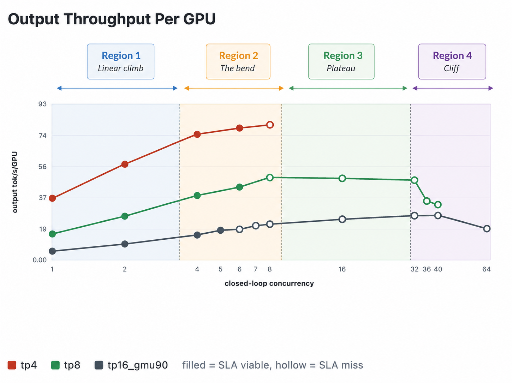

# Batching

The whole point of batching is that decode is memory-bandwidth-bound. At batch size=1, you pay the full cost of pulling weights from HBM just to generate a single token for a single user. That's wasteful, the weights are already on the wire, you may as well pipe more tokens.

So you stack many users' next-token computations into the *same* forward pass. Each pass reads the model weights once, and every user in the batch shares that read. If you can fit `B` users into a pass, you get `B` tokens out for roughly the cost of one read. That's the main trick.

But the savings have their own limitations, and the curve of "what happens as B grows" is an important shape in inference economics. It plays out in four regions, with clean bends between them.

## Region 1: The linear climb (small batch)

At low batch sizes, every additional user is nearly free. You're memory bound, and the GPU has tons of compute headroom sitting idle. Adding another stream to the pass costs you almost nothing on the bandwidth side because:

- Shared weights (attention layers, embeddings, the always-on shared expert) are read once per pass, regardless of how many users you stack into it.

- KV cache reads do scale linearly with batch (each stream has its own context), but at small batches their bytes are dwarfed by the weight reads.

So in this region, aggregate throughput climbs almost linearly with batch size, and per-stream throughput stays flat. Adding users is a pure efficiency win, the same bandwidth bill has more tokens per second out the door. Each user still sees the same fast stream even though we are scaling up concurrency.

## Region 2: The bend (medium batch)

Eventually batch grows large enough that the dynamics shift. Two things happen at once:

- [KV cache reads pile up linearly](https://medium.com/@plienhar/llm-inference-series-4-kv-caching-a-deeper-look-4ba9a77746c8). Each conversation stream pulls its own context's worth of K/V on every decode step, and at long context that's a fat number. Once KV reads become a meaningful fraction of per-pass bytes, scaling stream count scales bandwidth demand 1-to-1.

- Attention compute climbs with batch. The math is roughly: For each user in the batch: take *their* current token's Q vector, dot-product it against *their entire context* of K vectors, softmax, weighted-sum *their* V vectors. Obviously, it's not amortized across users the way weights are and therefore the compute grows with batch size.

The combined effect is that aggregate throughput bends downward off the linear line, and per-stream throughput starts dropping noticeably. You're still adding users productively, but each one costs more than the last and slows everyone else down a little.

This region is where you have to make a real decision of how much per-stream latency are you willing to trade for more concurrent users? The answer totally depends on your SLA as coding agents and chat etc have very different tolerances.

## Region 3: The plateau (large batch)

Push batch further and you hit the floor. What's left is per-stream cost: KV reads, attention compute. 

- These all grow linearly with batch, with no sharing left to exploit. The bottleneck doesn't change  you're still memory-bound but the bandwidth is now spent on per-stream KV reads instead of shared weight reads, and there's nothing left to amortize.

Pushing past this point is actively counter-productive. You're slowing every user down for no aggregate gain.

## Region 4: The cliff (too far)

There's one more region past the plateau, and it's the worst one. KV cache memory is finite. Each additional concurrent stream needs its own slice of VRAM to hold its context's K/V. Push concurrency high enough and the working set exceeds free VRAM, the engine starts evicting cached prefixes to make room, returning users miss cache and have to re-prefill from scratch, that stretches every request, which holds VRAM longer, which forces more eviction.

This is a positive-feedback collapse. Aggregate here falls off a cliff, and TTFT explodes from seconds to tens of seconds. The operational rule is to never run a node where working set is anywhere near the VRAM ceiling.

## Putting the regions together

| Region | What's happening | Aggregate TPS | Per-stream TPS | Bottleneck |
|---|---|---|---|---|
| **Small batch** | Shared weights amortize cleanly,  KV is small | climbs ~linearly | flat | HBM bandwidth |
| **Medium batch (the bend)** | KV and attention compute start dominating | bends sub-linear | starts dropping | KV reads + attention compute |
| **Large batch (the plateau)** | No more amortization left, every byte is per-stream | flat | crashes | HBM bandwidth (per-stream KV) |
| **Cliff** | Working set exceeds VRAM, eviction cascade | collapses | unusable | KV cache memory |




## How to pick the right batch size for your config

After all this, you probably want to know which batch size is best for your workload and sadly, there's no single answer. Coding agents, chatbots, agentic loops, and bulk generation each land in a different spot on the curve.

As an operator, your job is to find the largest batch size that still meets the per-stream SLA. Smaller leaves money on the table, and larger drops users below the SLA threshold for no aggregate gain. The goal of cost economics is figuring out which side of the bend your workload sits on and what works specifically for you.

Very often, you can't just grab a config online and ship it. vLLM and others publish reference configs, but those are tuned to specific traffic shapes and if yours differs, you can’t do the plug and play.

You need to load test to figure this out. Think of it as a search problem where you're searching the configuration space for the point that gives you the best value, and the only way to evaluate a point is to run your real traffic through it and measure what happens.

I'll talk more about working with inference providers and load tests later, but for now let me walk you through a load test we ran that helped us figure out the performance on different batch sizes and GPU configurations.

## Load test config

Our load test was done by the kind folks at CoreWeave. We tested TP4, TP8, and TP16 with batch sizes of 1, 2, 4, 8, 16, 32, 64 to figure out what works best for us.

We could walk through every batch size from 1 to 64, but the curve does exactly what theory predicted linear climb, bend, plateau, cliff and the only point that matters for cost economics is the plateau: the batch size where aggregate throughput is maximized before per-stream speed collapses.


For TP8 + Kimi K2.6 on Cline's workload, that's batch size = 16.

Why B=16 over the other obvious candidates:

- B=8 is faster per stream (~54 tok/s), but the node is under-loaded, aggregate hasn't hit the bandwidth ceiling yet.

- B=16 sits exactly at the throughput plateau. Peak aggregate output, lowest \$/token, cache hit rate still healthy.

- B=32 keeps aggregate flat (no improvement over B=16) but per-stream collapses to ~14 tok/s. Same total tokens out but much worse per-user latency.

- B=36+ is past the cache cliff. TTFT explodes, cache effectiveness collapses, throughput crashes.

## Napkin math breakdown of a single config

We're only showing the math for one batch, B=16, because the rest of the curve doesn't change the answer. There's a separate, equally important question we're parking until after this walkthrough: whether running 8 GPUs as one tensor-parallel group is even the right structure as  we tested TP4, TP8, and TP16 configs. We'll come back to it once the per-batch math is anchored, because that answer matters more than batch size does.

With this breakdown, you'll get critical SLA values like tokens per second, aggregate output tokens per second, processed throughput per node, cost per million processed tokens, and time to first token. We'll derive each one from first-principles math, then confirm it matches the load test. You should do this exercise for your own config.

## Formula chain

For any batch size B, decode throughput falls out of five steps:

```javascript
per_pass_bytes(B)   = routed expert reads + shared/dense weights + KV reads
memory_time(B)      = per_pass_bytes / (bandwidth × MBU)
per_pass_time(B)    = fixed_overhead + memory_time × overlap_factor
per_stream_TPS(B)   = 1 / per_pass_time
aggregate_TPS(B)    = B × per_stream_TPS
```

Hardware constants for the 8× B200 node:

- Effective HBM bandwidth: 50 TB/s (raw 64 minus sync overhead)

- Effective MBU on MoE long-context: real-world vLLM/MoE typically lands closer to ~11% as measured above

- Fixed per-pass overhead (TP collectives + MoE all-to-all + kernel launches): ~5.2 ms (linear-fit intercept from measured 8-GPU benchmarks)

## Case: Batch = 16

**Step 1: Bytes per pass:**

| Component | Math | Bytes |
|---|---|---|
| Routed experts hit | ~109 unique experts/layer × 61 × 22.5 MB | ~149 GB |
| Shared weights (attention + embeddings + shared expert) | constant | 5.6 GB |
| KV cache reads (80K context) | 16 × 2.8 GB | 44.8 GB |
| Total per pass |  | **~200 GB** |

The 109 unique experts come from `384 × (1 − (376/384)^16) ≈ 109`. 

Naively 16 tokens × 8 experts/token = 128 expert slots, but only ~109 are unique, the rest are duplicates picked by multiple tokens. That's the sub-linear expert sharing(See [Occupancy problem](https://www.johndcook.com/blog/2023/05/25/occupancy-problem-distribution/)).

**Step 2: Memory time (napkin math):**

```javascript
memory_time = 200 GB / (50 TB/s × 0.50 MBU)
            = 200 GB / 25 TB/s
            ≈ 8.0 ms
```

We take a 50% MBU assumption here.

**Step 3: Per-pass time:**

**Per-pass time** is how long one decode forward pass takes, the time the GPU needs to read all the weights + KV for the batch, do the math, and emit one new token to each user in the batch.

Measured in load test: **~36.8 ms** at B=16. The number actually worth using as a predictor is the empirical linear fit from our 8-GPU benchmarks. We got the linear fit by making a linear equation from the TPS and Per pass times of benchmarks at different config to get a per pass time equation as a function of batch size:

```javascript
per_pass_time(B) ≈ 5.2 ms + 1.65 × B
per_pass_time(16) ≈ 31.6 ms   (~14% off measurement)
```

The remaining ~14% on top of the fit is attention compute, which starts to bite past B=8.

For contrast, here's what the first-principles napkin from Step 2 predicts:

```javascript
napkin per_pass_time = 5.2 ms fixed + 8.0 ms × 0.5 overlap
                    ≈ 9.2 ms
```

That's 4× off measurement, and it's worth pausing on *why*. The napkin smuggles in two optimistic fudge factors: a 50% MBU assumption ( in reality its is closer to 13% on vLLM + MoE + 80K context) and a handwavey overlap factor. Each one is off by roughly 2×; compounded, they account for the full 4× gap.

Later in the blog we have Warnings for engineers section which mentions that first-principles napkins routinely miss real inference stacks by 2–10×. I am not saying don't do napkin math, I am saying that you could use* napkin as a sanity check but use the empirical fit as the predictor, and always carry both.* 

**Step 4: Per-stream TPS:**

```javascript
Per-stream TPS = 1 / per_pass_time
per_stream_TPS = 1 / 0.0368 sec ≈ 27 tok/s per user
```

27 tok/s per stream is acceptable for our use case, it's roughly the speed you'd get from OpenRouter for this model anyway, so users won't notice. Note that: this was the observed value as well. 

**Step 5: Aggregate output TPS:**

```javascript
aggregate_output = output_per_GPU × 8 GPUs = 48.7 × 8 ≈ 390 tok/s
```

We compute this directly from the measured output throughput per GPU times 8, rather than the naive `B × per_stream_TPS = 432`, which overcounts because it ignores TTFT and end-to-end occupancy time.

**Step 6: Total processed throughput per node (Little's Law):**

For Cline's load test traffic, an average request looks like:

```javascript
fresh tokens (avg):   ~13K   (new content per turn,  ~16.5% of input)
cached tokens (avg):  ~71K   (prefix from KV cache,  ~83.5% of input)
output tokens (avg):  ~1K    (typical coding-agent response)
proc tokens/request:  ~85K   (fresh + cached + output)
```

To turn per-request tokens into per-second throughput, use [Little's Law](https://en.wikipedia.org/wiki/Little%27s_law): in a steady-state system, throughput equals concurrency divided by end-to-end latency per item.

To get processed throughput:

```javascript
per-stream TPS (lifecycle) = 390 / 16        ≈ 24 tok/s
e2e per request           ≈ 1,000 / 24       ≈ 41.8 s
sustained req/s           = 16 / 41.8        ≈ 0.38 req/s per node
proc throughput           = 0.38 × 85K       ≈ 32K proc tok/s per node
```

To get end-to-end latency:

```abap
decode_time = output_tokens × per_pass_time
            = 1,056 × 36.8 ms
            ≈ 38.9 seconds

e2e ≈ TTFT + decode_time
    ≈ 1.6s + 38.9s
    ≈ 40.5 seconds   (measured: 41.84s, within 3%)
```

Two things to call out about that chain:

- The per-stream number is the lifecycle TPS from Step 5 (390 ÷ 16), not the 27 tok/s steady-state decode rate from Step 4. The lifecycle number already bakes in the prefill tax, so we don't need to add TTFT separately.

- The 83.5% cache hit rate doesn't change `proc tok/s`  input counts as processed whether it's cached or fresh. The cache split matters in two other places: (a) Step 8's TTFT math, where only the fresh portion drives prefill load, and (b) API pricing, where cached input bills at a discount.

Sanity check against Step 5: the output share of that 32K is `0.38 × 1K ≈ 380 tok/s`, which reconciles with the 390 tok/s aggregate output from Step 5 within rounding. Checks out.

**Step 7: Cost per million processed tokens:**

```javascript
node_cost          = $48 / hour
proc_throughput    = 32K tok/s × 3,600 = 115M proc tok/hour
$/M processed      = $48 ÷ 115M  ≈  $0.42 / M
```

In other words, if the GPU is running flat out around the clock, every million tokens processed through it costs us \$0.42.

**Step 8: TTFT (time to first token):**

The same chain also predicts TTFT, which is set by how long it takes to prefill a new request's fresh tokens while sharing compute with the other concurrent users in flight:

```javascript
TTFT ≈ fresh_tokens × concurrency / replica_prefill_rate
```

At TP8 c=16 with Cline's workload:

```javascript
fresh_tokens (median):       ~9,400 tok/request
replica_prefill_rate:        ~78,000 tok/s  (8× B200, ∼6.4% MFU)
concurrency:                 16
TTFT ≈ 9,400 × 16 / 78,000  ≈  1.9 seconds
```

The measured TP8 c=16 TTFT p50 was 1.57s during our load tests: the napkin matches the measurement within ~20%.

Notice how we calculated most of the critical SLA values here, both from first principles and then also verified them from the load test. This is the point of doing it in napkin math so that you can see how the puzzle pieces of inference optimization fit together. 

## What we actually used: TP4 c=8

This example of TP8, C 32 (8 GPUs per replica, 32 concurrent users per replica) is a great for explaining the inference math but not so much for prod work loads. The \$0.42/M number is proper pricing math, but the comparison with the API (\$0.317/M) does not justify the operational complexity of running our own inference. 

The perfect value we actually used was TP4 c=8 (4 GPUs per replica, 8 concurrent users per replica), and the dollar math gets meaningfully better.

The same formula chain at TP4 c=8 gives:

```javascript
GPUs per replica:        4
Cost per replica/month:  4 × $6 × 730 = $17,520
Per-stream TPS:          ~46 tok/s
Per-replica proc tok/s:  ~26,600
Tokens per replica/mo:   26.6K × 3600 × 730 = 70 B at 100% utilization
$/M processed:           $17,520 ÷ 70,000 = $0.250 / M
```

Two TP4 replicas fit on each 8-GPU physical node, so the same \$48/hr box now produces ~53K proc tok/s instead of 32K, so the same hardware has ~63% more throughput. This was because smaller tensor-parallel groups (4 GPUs vs 8) have less cross-GPU sync overhead per forward pass, which more than offsets the smaller batch per replica. At TP4 c=8, self-host is ~21% cheaper than the API per token, but only if the replicas stay busy all the time.
