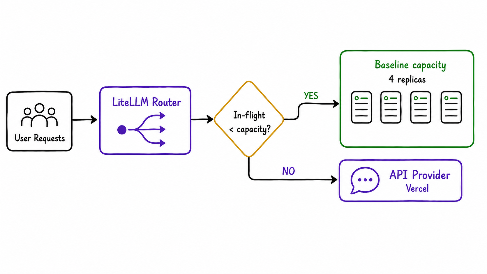

# Sizing the fleet of GPUs

Self hosting has fixed cost. The problem with GPUs is that a box that's 50% idle effectively doubles its \$/M token.  So we don't size for peak load, we size for the **floor of the load,** the lowest hour of the day, so the boxes stay at 100% utilization 24/7. Everything above the floor flows to the API via LiteLLM and this way we maximize GPU usage. 

Cline's traffic shape (from three days of our gateway data):

| Scenario | QPS | Concurrent (in-flight) | Total proc tok/s |
|---|---|---|---|
| P50 (median hour) | 2.6 | 73 | ~222K |
| P90 (busy hour) | 3.4 | 103 | ~290K |
| P99 (peak hour) | 3.8 | 111 | ~327K |
| Estimated trough (overnight) | — | — | ~110K |

To keep all replicas at 100% utilization, we size at ~the trough:

```javascript
N replicas × 26.6K proc tok/s ≤ 110K proc tok/s
N ≤ 4 replicas (= 2 physical 8-GPU boxes)
```

4 TP4 replicas (2 physical boxes) is the largest fleet that runs 100% utilized 24/7. Everything above flows to the API via LiteLLM.



```javascript
Self-host (4 TP4 replicas, 100% utilized):
  Cost:            4 × $17,520 = $70,080 / month
  Tokens served:   4 × 70B = 280 B proc tokens / month
  
API spillover (everything above 4 replicas):
  Tokens served:   583B − 280B = 303 B proc tokens / month
  Cost:            303B × $0.317/M = $96,051 / month

Total:             $70K + $96K = $166K / month
```
