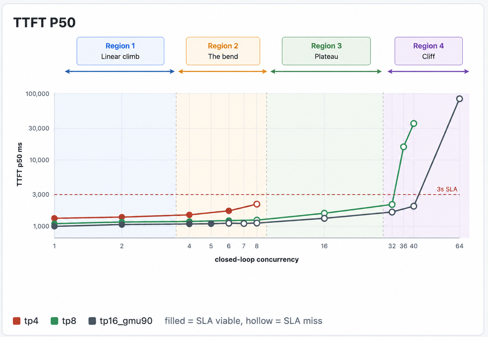
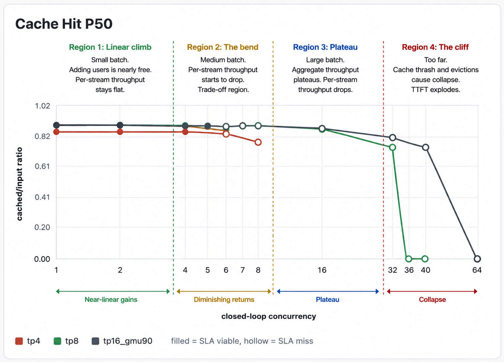

# How to actually run a load test

## Fake traffic vs real traffic

There are two ways to run a load test:

1. Fake traffic: synthetic prompts, scripted patterns, made up workloads. Easy to set up, but the numbers tell you very little about your real system. Useful for smoke tests, not for decisions.

2. Real traffic: mirror a slice of your actual production traffic onto the test endpoint. This is what you want.

The cleanest way to do the real-traffic version is to use a lightweight LLM as a proxy in front of your gateway, mirroring a small concurrent slice of inbound requests (and their outputs) to the candidate GPU machine for a short window. You don't need to redirect all your traffic, a small concurrent fraction is more than enough to characterize each operating point. You're not load testing your *whole* system, you're stress-testing one replica with a representative shape of your real workload.

## What you're searching for

The search space has two main axes:

- **Batching Concurrency:** how many in-flight streams the replica is serving at once.

- **Tensor parallelism:** how many GPUs each replica is sharded across (TP4, TP8, etc.).

The job is to find the right (concurrency, TP) combination on each candidate GPU configuration, then compare configurations against each other.

Example: say you're evaluating 3 different GPU configurations. For each one, run at least 4–5 different concurrency levels against your mirrored traffic. That's a 3 × 5 = 15-point grid, each point a short load test driven by a small concurrent slice of replayed traffic. Cheap to run, and at the end of it you have an actual map of the space to figure out what works best for you.

## What to measure at each point

For every (config, concurrency) point in the grid, record:

- **Tokens per second per GPU.** Reality-check that the GPUs are performing the way the hardware specs say they should. Way off, and something upstream is wrong.

- **Output throughput per GPU** and **per-stream decode tok/s.** Tells you how much decoding is actually happening, and how the experience feels to a single user inside that batch.

- **TTFT (time to first token).** Captures real prefill cost under realistic concurrency, not the idle-node best case.

- **Cache hit rate.** This is the load-bearing one. The moment cache hit rate starts dropping as concurrency climbs, you've exhausted KV cache, you're falling off the cliff, and everything downstream of that point is meaningless. The only operating points worth shipping are the ones with a healthy *steady-state* cache hit rate.

From these numbers, plot the curves: aggregate throughput vs. concurrency, per-stream TPS vs. concurrency, TTFT vs. concurrency, cache hit rate vs. concurrency, for each GPU config on the same axes. The shape of the curves is what tells you what you're optimizing for. These are a few curves from our load tests 

## Who runs the bake off

If you work with inference providers, you can ask them to run this exact grid against your mirrored traffic, they have the tooling for it, and any provider serious about your business will do it. Or you can stand up your own endpoint and run the grid yourself, which is what I'd recommend if you're genuinely considering self-hosting. The conversations with providers go very differently when you walk in with your own load-test data. In general: just do whichever fits your situation. 
